# Fields available in the Prestashop connector export profiles

## Common fields to all export profiles

These are the basic configuration fields that allow to configure the connection between Akeneo and Prestashop.

**Basic export configuration:**

Here you have to complete the information allowing the Prestashop connector to access your Prestashop:

- the REST api key you've defined in Prestashop,
- the url of your Prestashop,
- optional: the http login and password protecting the acces of your Prestashop (if there is any, of course),
- the default Prestashop store view (which is name `default` on Prestashop first install),
- the default Akeneo locale you want to map to this default storeview,
- the prestashop website on which you want to send your data (`base` on default Prestashop installation).

**Locales mapping:**

In addition to the default locale, you can map as many Akeneo locales you want to other Prestashop store views.

## Attributes and attribute sets export profile

**Attribute not in PIM anymore:**

Choose if you want the Prestashop connector to delete attributes and attribute sets that do not exists in Akeneo anymore, or to let these attributes untouched in Prestashop.

**Force attribute set removing:**

If an attribute set is deleted from Akeneo, then you can let the connector delete it in Prestashop. However, if there still is products attached to this attribute set, then you have to force Prestashop to delete these products with it, or the attribute set will remain intact.

**Attribute mapping:**

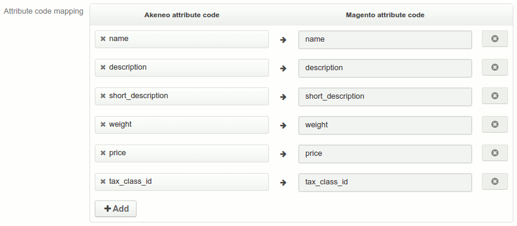

Choose how to map your Akeneo attributes to your Prestashop attributes. The profile give you a default mapping for the Prestashop mandatory attributes. However, you can choose whatever Akeneo attributes you want to map with them.

You don't have to map all attributes: the non mapped Akeneo attributes will automatically be mapped to a Prestashop attribute with the same code. If there is not, then an attribute will be created on Prestashop.

Remember that Prestashop system attributes cannot be modified, so be sure that the corresponding Akeneo attributes are identical.

## Categories export profile

**Category is anchor:**

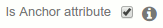

Allow you to choose if a category is to be navigated in the layered navigation way or in the traditional category/subcategory way.

**Category url key:**

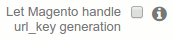

Choose if you want that the connector generates the generation of the url key or if you prefer that Prestashop handles them (with the risk that Prestashop make duplications).

**Category mapping:**

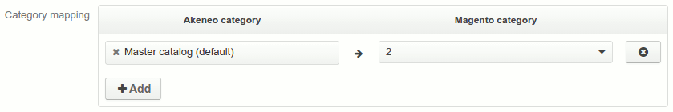

Choose which Akeneo tree you want to map with which Prestashop category (usually it should be the default Prestashop category).

**Category not in Akeneo anymore:**

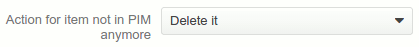

Deleting a category in Akeneo doesn't mean it has to disappear from Prestashop. You can choose to delete it, but you can also choose to simply disable it, or leave it as it is.

## Product export profile

**Status on Prestashop:**

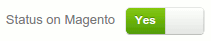

Choose of you product is enable or not in Prestashop.

**Product visibility:**

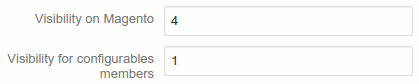

You can choose the visibility of your products, and for the simple products that are member of a configurable product. Choices are:

1. not visible individualy,
2. catalog,
3. search,
4. catalog and search.

**Currency:**

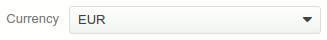

Choose the currency you use in Prestashop

**Images:**

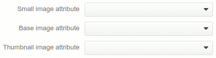

Choose what images stored in Akeneo you want to export to Prestashop.

**Product url keys:**

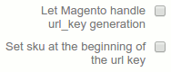

Choose if you want that the connector generates the generation of the url key or if you prefer that Prestashop handles them (with the risk that Prestashop make duplications).

If you let the connector generate them, as sometimes Prestashop truncate too long url keys, you can choose to put the product SKU at the beginning of the url keys rather than at the end. It will prevent duplications.

**Category mapping:**

Choose which Akeneo tree you want to map with which Prestashop category (usually it should be the default Prestashop category).

**Attribute mapping:**

Choose how to map your Akeneo attributes to your Prestashop attributes. This mapping must be the same than the one in the attribute export profile.

**Product associations:**

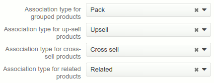

Here, you can map the product association types between Akeneo and Prestashop.

**Product not in Akeneo anymore:**

Like the categories, you can choose to delete, disable or let untouched product that are not in Akeneo anymore, but also products that are not complete anymore.

What's more, there is some product types (downloadable, bundle and virtual) that do not exist in Akeneo. You can choose to let them be or to delete them on your product export.
