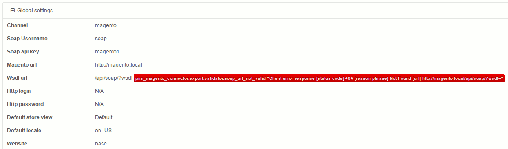
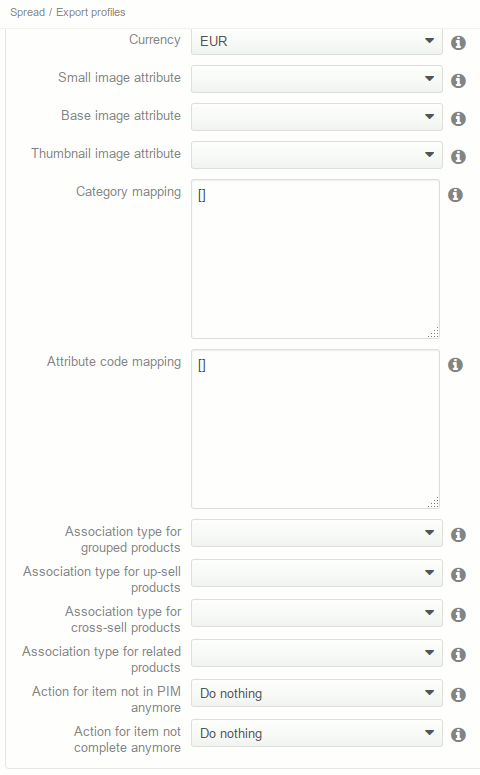

# Troubleshooting

## Prestashop URL problem

If you encounter an error message complaining about wsdl url, like in the following screenshot, then you probably have a problem with URL Rewriting.

First, check that URL rewriting is enabled in Prestashop (in `System > Configuration`, go to `General > Web > Search Engines Optimization` and select “Yes”).

If the problem persists, you probably have a non standard Apache configuration. Then you can simply complete in the PIM export profile the Prestashop URL by adding `/index.php`.

## Error Fetching http headers

This error can appears when you have some troubles on Prestashop server. It probably means that a Segmentation fault or something like that occurs on your Prestashop server. You can take a look at Prestashop or Apache2 logs (on Prestashop server) to have more informations.

## Cannot create image

This error is in fact pretty rarely linked to images themselves. When the Prestashop Connector Bundle sends the image after the product has been created or updated, Prestashop goes through the Product save event flow. On this event, the url_key is generated. If a product has already been created with the same name, the url_key cannot be generated and an error is issued, triggering a "Cannot create image" error, and losing at the same time the real reason why the image was not created.

To debug, you can add a log in the Mage_Catalog_Model_Product_Attribute_Media_Api class, in the catch(Exception $e) (around line 186, to log what is the real Exception).

## Unable to find category

If you already sent the categories with the category export or the full export, but the Prestashop Connector Bundle still tells you that the category must be exported when you export products, there's a high chance that you spell the Prestashop URL and the WSDL URL differently between the export that sent categories and the product export. Sometimes, you've added a "/" at the end of the Prestashop URL parameter on one of the export and none on the other. It's enough so for the Prestashop Connector to believe it's a different Prestashop so the previously exported categories are not part of the same Prestashop.

## Storeview mapping form display as brut text

If you encounter a problem with the “Storeview mapping” form, like in the screenshot below:

*Storeview mapping form problem*:

then you probably have forget to reinstall assets after installing the Prestashop connector. A simple

    php app/console pim:installer:assets
    
should settle the problem.

## Nothing happens on attribute group update

If one move an attribute from an attribute group to another one in Akeneo, the change cannot be passed on Prestashop. See more details in the [user guide](./userguide.md "Not supported") to understand why.
