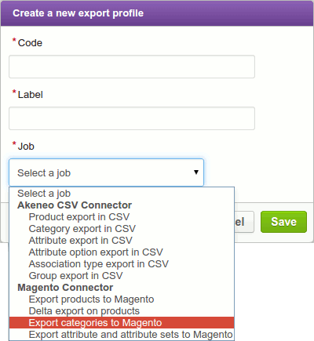
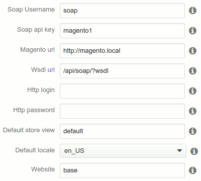
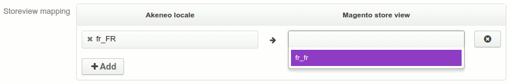

# User Guide for the Prestashop connector bundle

This user guide is primarily focused on the Prestashop connector bundle v1.2, but hints are presented for the previous 1.1 version.

## Mandatory attributes

The following Prestashop's attributes are mandatory for Prestashop and have to be created or mapped in Akeneo:

- name
- price
- weight
- description
- short_description
- tax_class_id

Also note that you should NEVER try to change/update attributes on Akeneo that are of system type on Prestashop side (except if you really want to completely break your Prestashop install). Your Akeneo attributes need to have type corresponding to Prestashop attribute types (see below Attribute type mapping).

However, this rule **doesn't apply to tax_class_id**. This particular attribute must be a **number type** on Akeneo side. Indeed, even if it is a simple select attribute on Prestashop side, the soap api will expect a number when exporting products. This number corresponds to the id of the product tax class. By default, these Prestashop values are 0 (none), 2 (taxable goods), and 4 (shipping). You can access these values on Prestashop admin panel: `Sales > Tax > Product Tax Classes`.

## Attribute type mapping

<table>
<header>
<tr>
<th>Akeneo Attribute type</th><th>Prestashop attribute type</th>
</tr>
<tr>
<td>Date</td><td>Date</td>
</tr>
<tr>
<td>File</td><td>N.A.</td>
</tr>
<tr>
<td>Identifier</td><td>Text field with unique value</td>
</tr>
<tr>
<td>Image</td><td>Media image</td>
</tr>
<tr>
<td>Metric</td><td>Text field</td>
</tr>
<tr>
<td>Multi select</td><td>Multiple select</td>
</tr>
<tr>
<td>Number</td><td>Text field</td>
</tr>
<tr>
<td>Price</td><td>Price</td>
</tr>
<tr>
<td>Simple Select</td><td>Dropdown</td>
</tr>
<tr>
<td>Text</td><td>Text field</td>
</tr>
<tr>
<td>Text area</td><td>Text Area</td>
</tr>
<tr>
<td>Yes/No</td><td>Yes/No</td>
</tr>
</header>
</table>

You can now create export jobs.

## Exporting structure

First, you need to export Akeneo's structure to Prestashop, in order to have the same organisation on both sides.

This is done by two distinct export jobs: `prestashop_category_export` (which export categories, what a surprise!) and `prestashop_attribute_export` (which export attributes, families (named attribute sets on prestashop), and options).

**Note**: In v1.1, the recommended way to export the structure was to perform a `prestashop_full_export`, to avoid any conflicts. `prestashop_category_export` had already the same use, however `prestashop_attribute_export` did only export attributes, not families nor options.

**Note**: Only attributes that are linked to a family will be exported to Prestashop.

Go to `Spread > Export profiles` and create these two jobs (the order you choose for creating or running them has no importance at all):

*Prestashop export profile creation*:

Then complete the global settings of the configuration. You only have to complete basic information about Prestashop, and cannot complete any storeview or attribute mapping for the moment. Once completed, save the configuration, and edit it again.

*Example of a basic export configuration*:

The Prestashop connector bundle now knows your Prestashop install and can propose you the mapping. You have to map any other active Akeneo locales with a corresponding Prestashop store view. Note that you already have mapped a default Akeneo locale with a default Prestashop store view, so you only have to map additional locales.

*Locales mapping*:

Complete category and attribute export profiles and save them again. Go take a look at the [list of options](./fields_list.md) availaible for each profiles for more details. You can now run them both, and you will have your Akeneo structure in Prestashop.

Remember that export jobs, once launched, run as background tasks, so you don't have to wait until structure export finishes to start creating you product export (but of course you have to wait and check it succeeds before running the product export). You can check if export succeeds (or fails and then see why) by going to `Spread > Exports history`.

You are now ready to export your products.

## Exporting products

Create a new export profile and select `prestashop_product_export`. Complete the global settings the same way you complete them for the structure export. Save the profile and edit it again. You can now map additional store views, default category, and attributes.

Optionally, you can also choose if the product is visible or not on Prestashop, the currency, thumbnails, associations… Again, take a look at the [list](./fields_list.md) to see all existing options.

And remember that, like for any other Akeneo export jobs, products have to be **complete and active** to be exported.

### ! Important

The product export is in fact a delta export: only products updated since the last export will be exported again. If this is the first time you run it, then all products will be exported.

However, if for any reason you need to make a full product export again, you can erase all delta information in the database (see the `Cleaning tables` section). Then run your product export jobs and all products will be exported.

## Debugging SOAP calls to Prestashop

If you have unusually long export time, there is a hidden feature, disabled by default, that allow you to log every call made by the Prestashop connector to the Prestashop SOAP API, and their duration. It will allow you to know if the problem come from Akeneo export or Prestashop response time. However, to enable this feature, you will have to dig in the code a little, so go for it only if you know what you're doing.

First, locate the Prestashop connector bundle in your Akeneo environment. It should be in `installation-folder/vendor/akeneo/prestashop-connector-bundle/Pim/Bundle/PrestashopConnectorBundle/` (`installation-folder` being your Akeneo environment, of course). In this folder, find the `PrestashopSoapProfiler.php` file, located inside the `Webservice` folder. You're here? Good.

Around line 18, locate the following piece of code: `const IS_LOG_ACTIVE = false;`. You just have to replace the keyword `false` by `true`. Then, a file named `soap_profile.log` will appear in `installation-folder/app/log/batch/`, containing all the SOAP calls and their duration.

Once your debugging done, don't forget to put `IS_LOG_ACTIVE` to `false` again. Furthermore, remove the log file each time you want to log a new export job, otherwise the data of the new export will be log in the wake of the previous one.

## Cleaning tables

### Mapping tables

If for any reason, you need to clean the mapping tables of your Akeneo environment (for instance if you completely reinstall your Prestashop instance, or switch to a new one), you can do so thanks to this command:

    php app/console prestashop-connector:mapping:purge job_instance_code

where `job_instance_code` is the code you give to your export job. Remember that you can retrieve the list of all your export jobs by running:

    php app/console akeneo:batch:list-jobs

### Delta tables

If you want to perform a full product export again, you need to clean the information contained in the delta tables. For that, just run:

    php app/console prestashop-connector:delta:purge job_instance_code

As for the mapping tables, `job_instance_code` is the code you give to your export job. You still can retrieve the list of all your export jobs by running:

    php app/console akeneo:batch:list-jobs

## Multiple Prestashop environments

Since Prestashop connector v1.1.21 (and thus also in v1.2), it is possible to export from a single Akeneo environment to several Prestashop environments.

You just have to create for each Prestashop environment the 3 jobs (attribute export, category export and product export) with the corresponding Prestashop url. The mapping can be different from one Prestashop to another, but remember that it MUST be the same between the jobs of a same Prestashop environment.

# Not supported

## Attribute groups update

In Akeneo, attribute groups are only related to attributes. It is not the case on Prestashop where they depend on attribute sets. The SOAP API define the group of an attribute when adding it to an attribute set.

The problem is that the SOAP API only proposes [methods](http://www.prestashopcommerce.com/api/soap/catalog/catalogProductAttributeSet/productAttributeSet.html) to add and remove attributes from attribute set, nothing to update them, and the [Product Attributes methods](http://www.prestashopcommerce.com/api/soap/catalog/catalogProductAttribute/catalogProductAttribute.html) don't handle attribute groups.

So if you want to perform an update, you'd have to remove and add again the attributes you want to change the group, which is not possible if there is already products using these attributes.

## Specific attribute

In Akeneo, you have the possibility to add a specific attribute (which is not related to the product family) to a product. As this is not possible in Prestashop (an attribute has to be in an attribute set), if you do so, the specific attribute will not be exported to Prestashop, and the product export will fail.

So don't add specific attributes to products you want to export to Prestashop.

## Product url key updates on Prestashop EE

Due to a bug in Prestashop EE, it is not possible to update product url keys with the soap api.

## Map an Akeneo attribute with several Prestashop attributes

We know that's a user case but for now it's not possible to map an Akeneo attribute with several Prestashop attributes (for example PIM Description -> Mag Description AND PIM Description -> Mag Short description).
